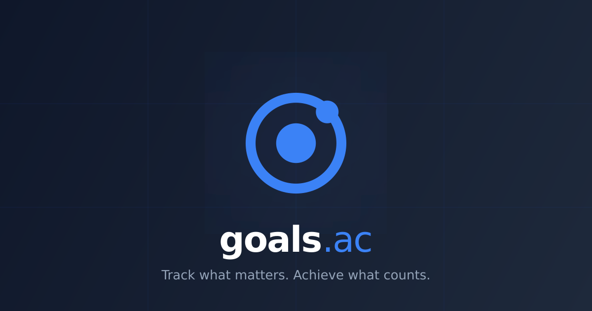

<p align="center">
  
</p>

# goals.ac

**AI-powered programmatic SEO platform for B2B startup growth roadmaps.**

Generate tailored 12-month growth roadmaps, SEO content strategies, article drafts, GEO audits, and a full content studio — all personalized to your company's brand, industry, and stage.

---

## Features

- **Growth Roadmap Generator** — AI-generated 12-month roadmaps by industry, location, and funding stage; public SEO directory
- **Content Studio** — Generate 20+ content formats (blog posts, LinkedIn threads, whitepapers, FAQs, etc.) with streaming progress
- **Content Repurposing** — Convert any content piece into a different format with phase-by-phase AI progress
- **Brand Profile** — Auto-scrape your website to populate company info, keywords, and audience; fine-tune voice, tone, and content style
- **Content Style Settings** — Persona name, tone preset, word count, language, reading level, forbidden words — injected into every AI prompt
- **SEO Article Generator** — Long-form SEO articles tied to specific roadmap phases
- **GEO Audit** — Generative Engine Optimization audit for AI search visibility
- **Keyword Research & Rank Tracking** — Opportunity discovery and SERP position snapshots
- **CMS Publishing** — Publish to WordPress, Shopify, Joomla, Drupal, Notion, Webflow, Ghost, or custom webhooks; encrypted credential storage
- **User Accounts** — Email/password and Google OAuth; bring-your-own AI provider key (Gemini, Bedrock, Ollama)
- **DB-Level Content Caching** — Repeated generation requests return instantly for the same project + format + keyword combination
- **Admin Panel** — Super-admin role with user management and content strategy views

## Tech Stack


| Layer | Technology |
|---|---|
| Frontend (product) | Next.js 14+ (App Router), React 19, Tailwind CSS 4, shadcn/ui |
| Frontend (legacy) | React 19, Vite 7 — redirect shell only |
| Backend | Next.js Route Handlers (canonical); Express 5 (legacy, opt-in) |
| Database | PostgreSQL 17 + Drizzle ORM + Zod validation |
| AI | Google Gemini 2.5 Flash (streaming); tiered provider abstraction (Bedrock, Ollama, BYOK) |
| Auth | NextAuth (Next.js app); JWT (legacy Express) |
| Jobs | pg-boss (Postgres-backed queue) |
| Caching | Redis (AI output, 24h TTL), in-memory LRU, DB-level content caching |
| CMS | WordPress, Shopify, Joomla, Drupal, Notion, Webflow, Ghost, Webhook |
| Monorepo | pnpm workspaces |

## Quick Start

For full local setup instructions (PostgreSQL, env vars, ports), see **[docs/local-dev.md](docs/local-dev.md)**.

### Docker (recommended)

```sh
git clone https://github.com/vineettalwar/goals.ac.git
cd goals.ac
docker compose up --build
```

Open **http://localhost:3001** once the app container is healthy. This starts the Next.js product app, background worker, and Postgres.

Optional: add API keys and OAuth credentials via `.env` (`cp .env.example .env`).

Legacy Vite + Express stack (debugging only):

```sh
docker compose --profile legacy up --build
```

### Manual

```sh
git clone https://github.com/vineettalwar/goals.ac.git
cd goals.ac
pnpm install
cp .env.example .env   # set AUTH_SECRET, NEXTAUTH_URL, DATABASE_URL, etc.
pnpm --filter @workspace/db run migrate
pnpm --filter @workspace/marketing-persona-app run dev   # Product app on :3001
pnpm --filter @workspace/worker run dev                  # Background jobs
```

## Documentation

| Document | Description |
|---|---|
| [docs/local-dev.md](docs/local-dev.md) | Full local development setup guide |
| [docs/design.md](docs/design.md) | Design system: tokens, dark/light mode, glass cards, typography |
| [docs/roadmap.md](docs/roadmap.md) | Product roadmap: shipped phases and upcoming work |
| [docs/DECISIONS.md](docs/DECISIONS.md) | Architecture decision records |
| [docs/memory.md](docs/memory.md) | Architectural decisions, gotchas, and historical context |
| [docs/admin.md](docs/admin.md) | Admin panel guide: super-admin role, user promotion, quota |
| [AGENTS.md](AGENTS.md) | Agent and contributor reference (stack, structure, workflows) |
| [CONTRIBUTING.md](CONTRIBUTING.md) | Database migration workflow and contribution guidelines |

## Project Structure

```
goals.ac/
├── artifacts/
│   ├── marketing-persona-app/   # Next.js product app (port 3001) — canonical
│   ├── worker/                  # pg-boss background job consumer
│   ├── api-server/              # Legacy Express REST API (port 8080, opt-in)
│   └── goals-ac/                # Legacy Vite frontend (port 5173, redirect shell)
├── lib/
│   ├── db/                      # Drizzle schema, migrations, seeding
│   ├── api-spec/                # OpenAPI spec — source of truth for API contracts
│   ├── api-zod/                 # Generated Zod schemas (Orval)
│   ├── api-client-react/        # Generated React Query hooks (Orval)
│   ├── ai-providers/            # Provider abstraction and tier routing
│   ├── connectors/              # CMS adapter clients (WordPress, Shopify, etc.)
│   ├── content-engine/          # Brand scrape, keyword opportunities, platform voice
│   ├── jobs/                    # pg-boss queue contracts
│   └── seo-tools/               # GEO auditor, competitor/keyword analyzers
├── cms-plugins/                 # Server-side CMS plugins (WordPress, Joomla, Drupal, Shopify, …)
├── docs/                        # Project documentation
├── docker-compose.yml           # Default stack: Next app + worker + Postgres
├── .env.example                 # Required environment variables
└── CONTRIBUTING.md              # Migration workflow
```

## Contributing

1. Never write migration SQL by hand — always use `pnpm --filter @workspace/db run generate` after schema changes. See [CONTRIBUTING.md](CONTRIBUTING.md).
2. New API routes in the Next.js app must use `requireAuth` from `@/lib/require-auth`.
3. Run `pnpm run typecheck` before pushing.

## License

Private. All rights reserved.
