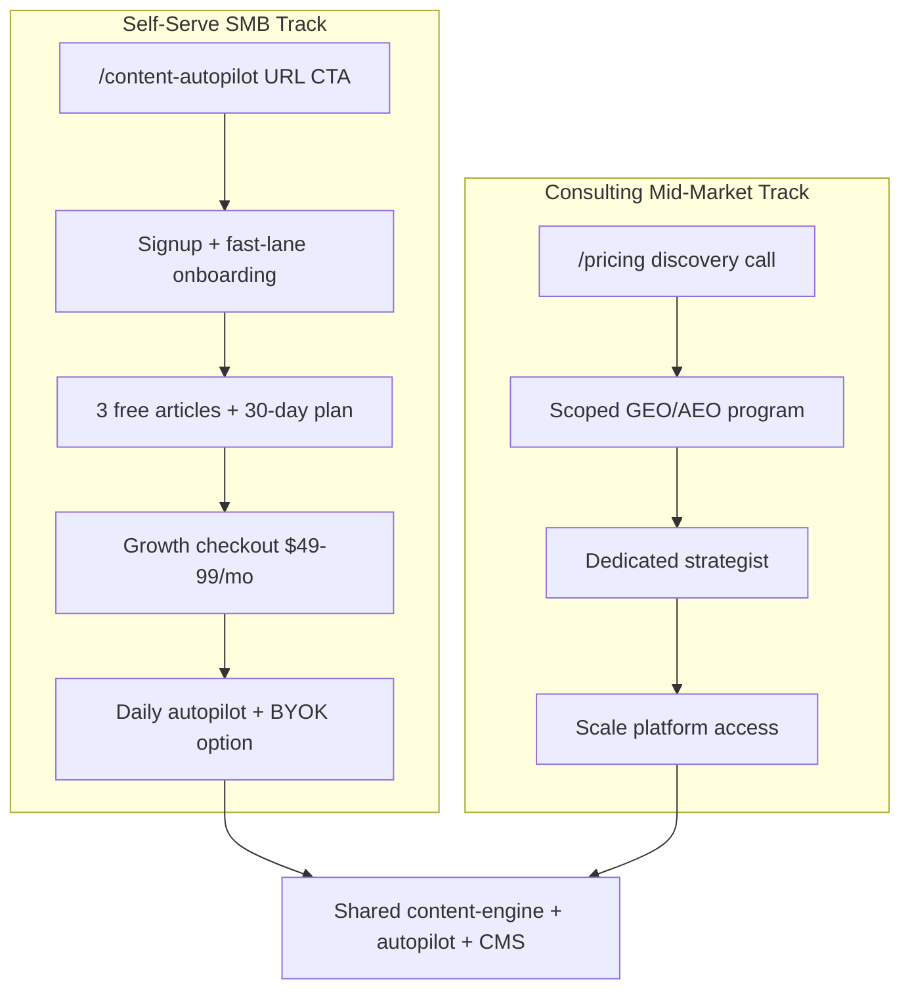

# Dual-Track GTM — SMB Self-Serve + Consulting Mid-Market

**Workstream E** · July 2026

> **Current GTM (Jul 2026):** goals.ac is **consulting-led, partner-only, no public pricing**. This doc describes a **future self-serve hypothesis**, not active packaging. Active competitor response: [babylovegrowth-parity-planner.md](./babylovegrowth-parity-planner.md).

---

## Two front doors, one engine

## Track definitions

| | Self-serve SMB | Consulting mid-market |
|---|----------------|----------------------|
| **Buyer** | Solo founder, local service, Shopify store | B2B SaaS, regulated, multi-site |
| **Entry** | URL on `/content-autopilot` | Discovery call on `/pricing` |
| **Offer** | 3 trial articles → Growth autopilot | GEO/AEO program + strategist |
| **Price** | Free Starter (5/mo) → **Growth $49/mo** (30 articles) | Scoped engagement |
| **Automation** | Daily autopilot, draft default | Weekly review, optional live |
| **Differentiator vs AutoSEO** | Humanization, BYOK transparency, no link schemes | Strategy depth, compliance, LLM tracking |

## Pricing hypothesis

| Plan | Price | Articles/mo | Sites | Notes |
|------|-------|-------------|-------|-------|
| Starter | Free | 5 | 1 | BYOK required for AI |
| Growth | $49/mo | 30 | 3 | Self-serve Stripe; daily autopilot |
| Scale | Contact | Unlimited | Unlimited | Consulting + platform |

**BYOK:** Growth subscribers can use platform key (quota) or BYOK (unlimited generations, orchestration fee only).

## Pages to update

| Page | Change |
|------|--------|
| `/content-autopilot` | URL hero CTA → signup with intent |
| `/pricing` | Add SaaS tier cards above consulting engagements |
| `/compare/ai-seo-tools` | New comparison rows (infographics, self-serve, SLA) |
| `/signup` | Honor `from=content-autopilot` intent |
| `/onboarding/fast-lane` | New simplified path |
| Dashboard | Autopilot activity panel |

## Messaging

**SMB vs AutoSEO:** *"Same autopilot velocity. Better articles, transparent costs, and a strategy that compounds — without sketchy link exchanges."*

**Mid-market vs AutoSEO:** *"AutoSEO publishes daily posts. We run a GEO/AEO program with editorial control, compliance, and measurable AI visibility."*

## Do not claim until built

- Backlink parity
- 100 languages
- Per-article infographics
- Hosted blog fallback
- 30-article SLA guarantee
