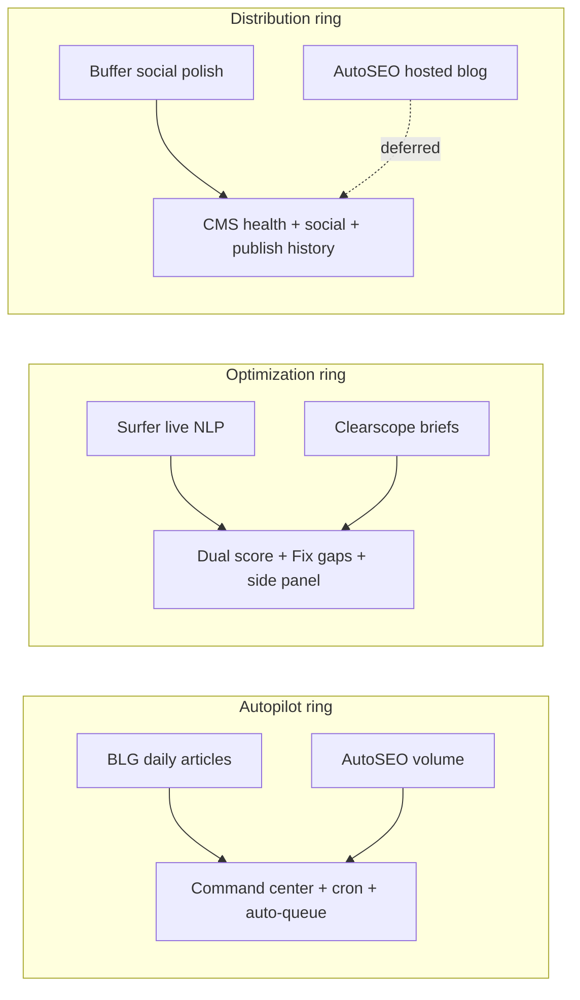

# PRD: Content Studio Competitive Plan

**Status:** Waves 0–5 shipped · **Wave 6 drafted** (honesty + proof + media) · Hosted blog (3.3) still deferred · Surfer NLP still deferred  
**ICP (90 days):** Partner-demo path vs BabyLoveGrowth / AutoSEO — consulting-led, not self-serve checkout  
**Related:** [babylovegrowth-parity-planner.md](../competitors/babylovegrowth-parity-planner.md), [DECISIONS.md](../DECISIONS.md), [HANDOFF.md](../../HANDOFF.md)

---

## Post–Wave 4 audit (2026-07-17) — why Wave 5

Trust surfaces shipped; remaining losses are **humanize durability** (BLG “needs editing”), **Studio create coherence**, and **integration depth** beyond WP/Ghost demo stacks.

| # | Weakness | Competitor who wins that moment | Wave 5 response |
|---|---|---|---|
| 1 | One-pass / optional humanize; reject path weak | BLG quality criticism | **5.A** Reject-below-threshold, structure guards, voice-gated generate, platform-voice social |
| 2 | Dual create paths; Bluesky/Mastodon missing from Next picker | Surfer / Buffer polish | **5.B** Format parity, Ready checklist, social tighten enhance |
| 3 | Thin CMS marketed equal to plugins; media/schedule honesty gaps | Buffer / AutoSEO WP wizard | **5.C** Ghost/Webflow updates, health gate, Basic publish badges, Mastodon admin honesty |

**Still deferred:** full Surfer NLP editor, hosted blog, TikTok/YouTube inbox, backlink exchange, detector APIs, self-serve public pricing.

---

## Post–Wave 3 audit (2026-07-16) — why Wave 4

Engines are largely shipped; remaining losses are **inspectability** and **demo coherence**, not missing backends.

| # | Weakness | Competitor who wins that moment | Wave 4 response |
|---|---|---|---|
| 1 | Humanize proof lives on marketing `/article-quality`, not Studio (body overwrite-only) | BLG / AutoSEO quality confidence | **4.0** Product before/after |
| 2 | No Surfer-style NLP terms (honest deferred) | Surfer | **4.3** Light secondary/PAA checklist (labeled non-Surfer) |
| 3 | Dual score is half-live (editorial live; SERP last-saved) | Surfer | **4.4** Honesty + save/ debounce SERP refresh |
| 4 | Brief → draft friction; insert only when body empty | Clearscope | **4.5** Outline append/replace when body present |
| 5 | Social humanize in pipeline, not composer UI | Buffer | **4.2** Composer Humanize |
| 6 | Publish history CMS-only; featured/media uneven | Buffer / BLG WP wizard | **4.6** Social publish records + soft media honesty |

**Still deferred:** full Surfer NLP editor, hosted blog, TikTok/YouTube inbox, backlink exchange, detector APIs, invent R2 public host, Drupal File entities, ponytail mass deletes.

---

## Problem

goals.ac is **engine-rich and experience-thin**. The platform already ships strong pipelines — humanization, dual editorial+SERP scoring, Fix-gaps enhance, 16 CMS connectors, social/ESP publish, autopilot cron, command center — but competitors win on **workflow coherence** and **demo-ready surfaces**.

**Canonical write-up:** [executive-diagnosis.md](../competitors/executive-diagnosis.md) (engines already live vs where packaging still wins the room).

| Competitor | What they win on | Where goals.ac lags in the room |
|---|---|---|
| **Surfer** | Live editor + real-time NLP term coverage while you write | Brief/SERP panel + live dual score shipped; still no term-level NLP highlighting |
| **BLG / AutoSEO** | Volume simplicity — URL → daily articles → quality score on the homepage | Humanize before/after + quality demo live; volume/billing packaging still partner-led |
| **Buffer** | Social polish — per-platform preview, voice, scheduling UX | Preview chrome, calendar polish, Queue social (LinkedIn/X + Meta), social humanize shipped; TikTok/YouTube/inbox still out of scope |

**Root cause:** Packaging and reliability gaps, not missing core engines. Closing the competitive gap means surfacing what we already built and hardening humanize + integration trust before chasing Surfer-style live NLP.

---

## Edge thesis

goals.ac wins partner conversations on three durable differentiators competitors cannot copy quickly:

1. **Humanize trust** — Auditable rewrite pass (slop diagnosis, heading/link preservation, brand voice sample), not black-box autopilot output. Counter BLG/AutoSEO “generic AI slop” with before/after proof.
2. **Studio writing room** — Brief + SERP context beside the draft, live dual score, Fix gaps — strategy-first GEO/AEO, not volume-only blog factory.
3. **Integration reliability** — 16 CMS + social + ESP with health cron, connect checklists, publish records — partners ship to real stacks, not hosted-blog fallbacks.

**Positioning lane:** Managed GEO/AEO with editorial control. Autopilot is a feature; human review and integration breadth are the product.

---

## Competitors ring

Three rings map competitor strengths to goals.ac wave priorities:



| Ring | Competitor exemplars | goals.ac response | Wave |
|---|---|---|---|
| **Autopilot** | BLG, AutoSEO — set-and-forget daily content | Fast-lane → dashboard, auto-queue on, command center, dashboard autopilot settings + activity panel (Wave 3.1) | 0 (demo assets), 3.1 (shipped) |
| **Optimization** | Surfer, Clearscope — score while writing | Side panel brief/SERP, live draft score, unify create UX, SVG visual summary — **not** full live NLP | 1 (+ summary polish shipped) |
| **Distribution** | Buffer — social scheduling polish; AutoSEO — hosted blog | Wave 2 trust + preview chrome, calendar polish, Queue social Meta; hosted blog deferred (3.3) | 2 (shipped); 3.3 deferred |

---

## Execution waves

### Wave 0 — Humanize reliability + demo assets (shipped)

**Goal:** Make humanization trustworthy in production and demoable against BLG/AutoSEO samples.

| # | Deliverable | Acceptance |
|---|---|---|
| 0.1 | **Humanize sanitize fix** — `sanitizeAiProse` runs after rewrite; slop score reflects sanitized output; no regression on heading/link guards | Humanize pass completes; audit `slopScoreAfter` matches sanitized body |
| 0.2 | **Secondary keywords** — `contentPieceToGeneratedArticle` passes `pieceMetadata.secondaryKeywords` (not empty `[]`) into humanizer prompt | Secondary terms survive humanize on content pieces with cluster/brief keywords |
| 0.3 | **DeepL re-humanize** — After DeepL translation pass, optional humanize on localized draft (English gen → DeepL → humanize chain) | Non-English projects get humanized localized output when DeepL + humanize enabled |
| 0.4 | **All-social humanize** — Humanize action on social composer formats (LinkedIn, X, Instagram, etc.), not articles-only | Social repurpose + composer expose humanize with platform limits respected |
| 0.5 | **Human-voice score** — Surface `scoreHumanVoice` breakdown prominently in article quality panel (already computed) | Quality panel shows human-voice row with actionable detail |
| 0.6 | **Before/after demo** — Marketing asset: side-by-side raw AI vs humanized sample for partner deck + `/article-quality` tie-in | Partner deck asset + optional public demo section |

**Out of Wave 0:** Detector APIs (GPTZero, Originality, etc.) — explicitly deferred.

---

### Wave 1 — Studio side panel + live draft score (shipped)

**Goal:** Surfer-like *feel* without building a live NLP engine — brief and SERP context beside the draft, score updates as the user edits.

| # | Deliverable | Acceptance |
|---|---|---|
| 1.1 | **Side panel brief/SERP** — Brief summary, target keyword, secondary keywords, competitor topics, PAA, SERP feature hints in `ContentPieceLayoutAside` | Panel loads from piece + `/serp-score` without full page navigation |
| 1.2 | **Live draft score** — Debounced re-score on body edit (editorial + SERP combined); show delta vs last save | Score updates within ~2s of pause typing; no server round-trip per keystroke |
| 1.3 | **Unify create UX** — Single create path in Studio (format picker → keyword/brief → generate) aligned across Next + `goals-app-ui` / Vite shell | One modal flow; repurpose remains secondary entry |

**Out of Wave 1:** Full Surfer NLP term coverage, real-time “terms to add” highlighting in editor — deferred to future tranche or never (see Deferred).

---

### Wave 2 — Integration trust + distribution polish (shipped)

**Goal:** Win Buffer-style distribution confidence and reduce partner “will publish break?” anxiety.

| # | Deliverable | Acceptance |
|---|---|---|
| 2.1 | **Health cron expansion** — `connectionHealthCheck` covers social (Meta, LinkedIn, etc.) and ESP creds, not only `project_cms` | Cron updates `lastHealth` on social/ESP tiles; failures surface in integrations UI |
| 2.2 | **IG image gate** — Block or warn on Instagram publish without image attachment | Composer shows clear gate; publish API returns actionable error |
| 2.3 | **Connect UX** — Finish setup steps on remaining CMS/social tiles (parity with WP/Ghost/Shopify checklists) | New connections show step checklist until health passes |
| 2.4 | **Publish history** — UI over `publish_records` (provider, status, output mode, timestamp) | Project publishing tab lists last N publishes with drill-down |
| 2.5 | **Article + social one-click** — From approved article, generate + queue social variants in one action | Single CTA creates linked social pieces and opens composer queue |

---

### Wave 3 — Optional depth (3.1–3.2 shipped · 3.3 deferred)

**Goal:** Partner-program polish and long-tail parity — only after Waves 0–2 demo path is solid.

| # | Deliverable | Notes |
|---|---|---|
| 3.1 | **Optional autopilot dashboard** — Unified activity panel (articles, publishes, LLM citation delta, GEO trend) + compact autopilot settings | Shipped — `/dashboard` activity panel + save autopilot settings |
| 3.2 | **Coverage % H2s** — SERP score shows H2 topic coverage % vs competitor headings | Shipped — `serp.h2Coverage` in quality panels |
| 3.3 | **Hosted blog** (`blog.customer.goals.ac`) | **Deferred** until self-serve GTM — not partner-demo priority |

---

### Wave 4 — Trust surfaces (in progress · overnight execute)

**Goal:** Make humanize, SERP feedback, and distribution **demo-inspectable** in product UI — without building Surfer NLP or BLG hosted blog.

**Done when (partner demo ≤20 min):** Studio shows before/after after Humanize; social composer can Humanize; quality panel shows a light term checklist + human-voice detail; SERP label matches refresh behavior; publish history includes social rows for LinkedIn/X/Meta.

| # | Deliverable | Acceptance | Verify |
|---|---|---|---|
| **4.0** | **Product before/after** — Persist `preHumanizeBodyMarkdown` on successful humanize; Studio toggle/diff (raw vs current); revert optional | After Humanize, toggle shows prior body; re-humanize updates snapshot | Manual Studio + unit on metadata apply |
| **4.1** | **Human-voice detail** — Surface `scoreHumanVoice` detail strings in quality panels (not score-only) | At least one actionable bullet under Human voice row | Typecheck app-shell |
| **4.2** | **Social composer Humanize** — CTA on LinkedIn/X/IG/FB/Bluesky/Mastodon drafts; respects length limits + audit badge | Composer → Humanize → body updates; score/audit visible | Typecheck shell + social host |
| **4.3** | **Light term checklist** — Secondary keywords + PAA/H2 tokens covered vs missing in draft (honest label: “Coverage checklist — not Surfer NLP”) | Checklist updates with editorial debounce | Unit on coverage helper + panel |
| **4.4** | **SERP refresh honesty** — Auto-refresh SERP on save and/or debounced server score; UI never implies live SERP if stale | After save, SERP updates without manual Refresh; or clear “last scored at” | Manual + typecheck |
| **4.5** | **Brief outline on non-empty** — Copy always; Insert offers Append / Replace when body present | Confirm dialog; no silent overwrite | Manual brief panel |
| **4.6** | **Social publish_records** — `publishPieceToSocial` writes publish history; Publishing tab shows CMS + social | Social publish creates history row | Typecheck content-engine |

**Out of Wave 4:** Full Surfer NLP highlighting, Content-media R2 bucket provisioning (ops), named GSC case studies, TYPO3 live-site smoke, dual create wizard merge, ponytail deletes.

**Execution discipline (overnight):** Fable-5 step loop; commit roughly every ≤5 files; **no Cloudflare deploy** (morning operator); **no ponytail deletes**.

---

### Wave 5 — Humanize durability + Studio/integration reliability (executed 2026-07-17)

**Goal:** Make quality + publish reliability the durable edge vs BLG/AutoSEO/Buffer — without Surfer NLP or hosted blog.

| # | Deliverable | Status |
|---|---|---|
| **5.A.1** | Generate humanize gated on brand voice sample (skip + warn when missing; light/strong when present) | done |
| **5.A.2** | Reject-below-threshold (no slop improvement / human-voice floor) with audit `reason` | done |
| **5.A.3** | Platform-voice presets + char limits on social Humanize | done |
| **5.A.4** | FAQ / citation / H2 structure hard guards | done |
| **5.B.1–2** | Next format picker + Bluesky/Mastodon; shell create notes Next as SSOT | done |
| **5.B.3** | Ready-to-publish checklist soft-block | done |
| **5.B.4** | Light social “tighten for platform” enhance | done |
| **5.C.1** | Ghost/Instagram media honesty in publish dialog | done |
| **5.C.2** | Ghost + Webflow create-or-update via prior `remoteId` | done |
| **5.C.3** | Health-gated CMS publish (skip when `lastHealthOk === false`) | done |
| **5.C.4** | CMS schedule honesty (native WP vs goals.ac sweep) | done |
| **5.C.5** | Mastodon admin catalog (instance-only info) | done |
| **5.C.6** | “Basic publish” badges on thin CMS tiles | done |

**Out of Wave 5:** Surfer NLP, hosted blog, TikTok/YouTube, detector APIs, self-serve checkout.

### Wave 6 — Honesty, proof, media (drafted 2026-07-23)

**Goal:** Close remaining demo losses from oversell, empty proof, and HTTPS media gaps — not new engines.

| # | Deliverable | Status |
|---|---|---|
| **6.A** | Marketing honesty punch list (16+/analytics/`llms.txt`/compare/pricing alignment) | **done** |
| **6.B** | Proof: empty-state polish **or** one permissioned story (no fakes) | **6.B2 done** (empty/method); 6.B1 pending rights |
| **6.C** | Content-media R2 happy path verified for IG/HTTPS gates | planned |

**PRD:** [wave-6-honesty-proof-media.md](./wave-6-honesty-proof-media.md)

**Out of Wave 6:** Surfer NLP, hosted blog, TikTok/YouTube, Basic-CMS deepen, dual create merge, invented case studies.

---

## Explicitly deferred

| Item | Rationale | Revisit when |
|---|---|---|
| Full Surfer NLP editor | High build cost; Wave 1 side panel + live score covers 80% of demo need | Partner feedback demands term-level highlighting |
| Hosted blog fallback | AutoSEO differentiator for CMS-less SMB; goals.ac is integration-first | Self-serve track launches ([dual-track-gtm.md](../competitors/dual-track-gtm.md)) |
| TikTok / YouTube / inbox | Out of ICP; Buffer parity partial only | Social expansion sprint |
| Backlink exchange network | PBN-adjacent; white-hat internal link hub instead | Never for core product |
| Detector APIs (GPTZero, etc.) | Legal/accuracy risk; human-voice score + before/after demo sufficient | Partner explicitly requests |

---

## Success criteria — partner demo path

A partner (or sales engineer) can run this **live demo in ≤20 minutes** without buried settings:

1. **Fast-lane** — URL → project → command center with keyword clusters visible.
2. **Generate** — Add & generate from cluster; draft opens in Studio with quality panel showing editorial + SERP + human-voice scores.
3. **Humanize** — Before/after visible; secondary keywords preserved; slop score drops in audit.
4. **Optimize** — Fix gaps enhance addresses SERP gaps; side panel shows brief context (Wave 1).
5. **Integrate** — CMS tile shows green health; connect checklist complete for demo stack (WP or Ghost).
6. **Publish** — Article publishes; publish history row appears (Wave 2); optional social one-click queues LinkedIn variant (Wave 2).
7. **Differentiate** — 12-month roadmap + BYOK + editorial control called out vs BLG black-box and AutoSEO volume.

**90-day ICP:** Win partner conversations vs BLG $99 autopilot and AutoSEO $49 entry. Public self-serve pricing remains deferred.

**Verify commands:**

```sh
pnpm run typecheck
cd lib/content-engine && npx vitest run src/articles/serp-content-score.test.ts
cd lib/seo-tools && npx vitest run src/keywordGapAnalyzer.refresh.test.ts
pnpm --filter @workspace/marketing-persona-app run typecheck
# Manual :3001 — humanize, serp-score, article-quality, integrations/health, content-studio create
# Manual CF preview — parity on humanize + serp-score routes
```

---

## File map — touch points

### Wave 0 — Humanize + demo

| Area | Files |
|---|---|
| Humanizer core | `lib/content-engine/src/content/humanizer.ts`, `lib/content-engine/src/content/ai-writing-rules.ts` |
| Content piece bridge | `lib/content-engine/src/content/content-piece-seo.ts` (metadata, `secondaryKeywords`) |
| Enhance + humanize chain | `lib/content-engine/src/content/content-piece-enhance.ts`, `lib/content-engine/src/content/content-studio-generator.ts` |
| DeepL chain | `lib/content-engine/src/support/integrations/deepl-refinement.ts`, `lib/content-engine/src/support/integrations/deepl-credentials.ts`, `lib/deepl/` |
| Human-voice score | `lib/content-engine/src/articles/article-quality-score.ts` (`scoreHumanVoice`) |
| API routes | `artifacts/marketing-persona-app/src/app/api/content-pieces/[id]/humanize/route.ts`, `artifacts/cf-write-worker/src/content-pieces.ts` |
| Quality UI | `artifacts/marketing-persona-app/src/components/content/article-quality-panel.tsx`, `lib/app-shell/src/content-piece/content-quality-panel.tsx` |
| Marketing demo | `artifacts/marketing-persona-app/src/lib/marketing/content/article-quality-demo.ts`, `artifacts/marketing-persona-app/src/components/marketing/pages/tools/article-quality-demo-client.tsx` |
| Social humanize | `lib/app-shell/src/social/social-composer-panel.tsx`, `lib/app-shell/src/social/social-ui.tsx`, `artifacts/marketing-persona-app/src/components/social/social-hub-client.tsx` |
| Schema | `lib/db/src/schema/content_pieces.ts` (`pieceMetadata.secondaryKeywords`, `humanized`) |

### Wave 1 — Studio side panel + create UX

| Area | Files |
|---|---|
| Piece layout + aside | `artifacts/marketing-persona-app/src/components/content/content-piece-layout.tsx`, `content-piece-layout-aside.tsx`, `content-piece-client.tsx` |
| SERP score API | `artifacts/marketing-persona-app/src/app/api/content-pieces/[id]/serp-score/route.ts`, `lib/content-engine/src/articles/serp-content-score.ts`, `artifacts/cf-write-worker/src/content-pieces-ai.ts` |
| Shared quality panel | `lib/app-shell/src/content-piece/content-piece-ui.tsx`, `artifacts/goals-app-ui/src/pages/ContentPiecePage.tsx` |
| Create flow (Next) | `artifacts/marketing-persona-app/src/components/content-studio/create-content-modal.tsx`, `create-content-create-*.tsx`, `content-studio-client.tsx` |
| Create flow (Vite) | `artifacts/goals-ac/src/pages/content-studio/content-studio-create-modal.tsx`, `artifacts/goals-app-ui/` shell routes |
| Brief / cluster context | `artifacts/marketing-persona-app/src/app/api/website-projects/[id]/keyword-clusters/route.ts`, keyword opportunity routes |

### Wave 2 — Integrations + distribution

| Area | Files |
|---|---|
| Health cron | `lib/jobs/src/handlers/connectionHealthCheck.ts`, `artifacts/marketing-persona-app/src/app/api/website-projects/[id]/integrations/health/route.ts` |
| Connect UX | `lib/app-shell/src/integrations/cms-connect-dialogs.tsx`, `cms-connect-types.ts`, `integrations-ui.tsx` |
| Publish records | `lib/db/src/schema/publish_records.ts`, publish pipeline helpers in `lib/content-engine/` |
| IG / Meta | `artifacts/cf-public-worker/src/auth-meta-pages.ts`, `lib/app-shell/src/social/types.ts`, Meta OAuth routes |
| Social hub | `artifacts/marketing-persona-app/src/app/(app)/projects/[id]/social/page.tsx`, `lib/app-shell/src/social/social-queue-panel.tsx` |
| Publishing tab | `artifacts/marketing-persona-app/src/components/projects/project-publishing-tab.tsx` |
| One-click article→social | `lib/content-engine/src/content/content-studio-generator.ts` (`repurposeContentPiece`), repurpose API routes |

### Wave 3 — Depth (3.3 still backlog)

| Area | Files |
|---|---|
| Command center / autopilot | `lib/content-engine/src/analytics/command-center-service.ts`, `artifacts/marketing-persona-app/src/app/api/website-projects/[id]/command-center/route.ts`, `project-automation-panel.tsx` |
| SERP H2 coverage | `lib/content-engine/src/articles/serp-content-score.ts` (coverage breakdown extension) |
| Hosted blog | Not started — future `artifacts/` worker + subdomain routing |

### Shared / cross-wave

| Area | Files |
|---|---|
| Content engine exports | `lib/content-engine/src/index.ts` |
| App shell | `lib/app-shell/src/content-piece/`, `lib/app-shell/src/integrations/` |
| CF gateway allowlist | `artifacts/cf-gateway/src/index.ts` |
| Competitor context | `docs/competitors/babylovegrowth-parity-planner.md`, `docs/competitors/goals-ac-capability-audit.md` |
| Decisions + handoff | `docs/DECISIONS.md`, `HANDOFF.md`, `docs/memory.md` |

---

## Open questions

- **DeepL → humanize order:** Humanize before or after DeepL for non-English? Default: English gen → humanize → DeepL, with optional re-humanize on localized output (Wave 0.3).
- **Live score debounce:** Client-only editorial score vs server SERP score on save — hybrid likely (editorial local, SERP on blur/save).
- **Social humanize scope:** All six platforms in one release or LinkedIn + X first?
